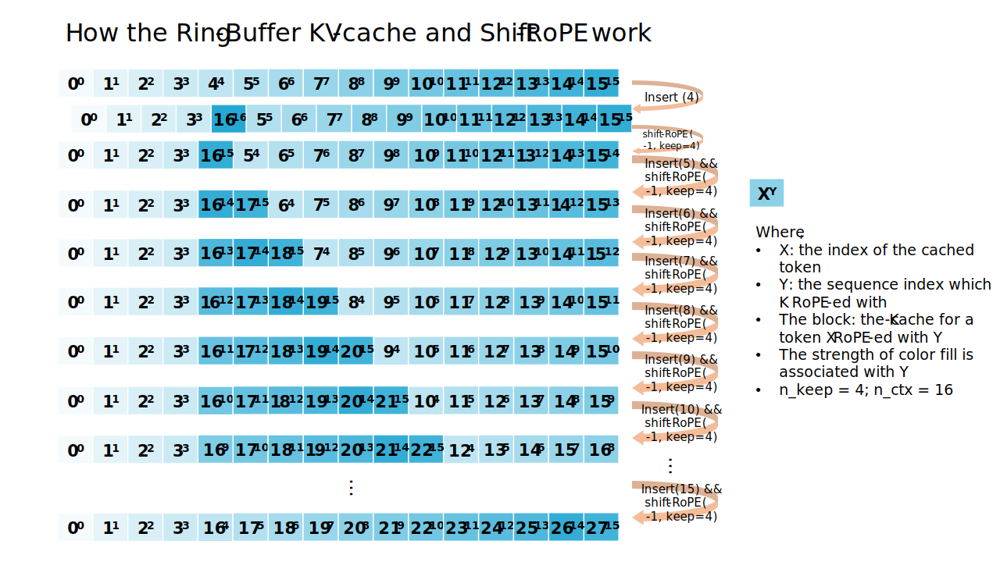
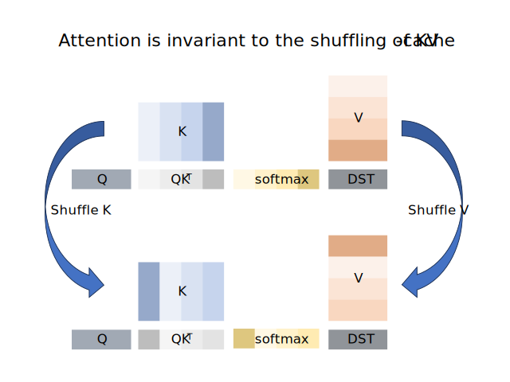

Infinite Inference
==================

As a key feature to many LLM applications like ChatBot, LLM Runtime supports infinite inference in two ways: re-evaluate and shift-RoPE-K. The discard and re-evaluate is available to all models, while the more efficient shift-RoPE-K method required certain models design and needs graph-level support to enable. Both methods are implemented according to the [StreamingLLM paper](https://arxiv.org/abs/2309.17453) and are able to preserve the fist `n_keep` tokens.

## Discard and Re-evaluate
By default, the LLM Runtime discards half of the recent tokens and re-evaluates the left sequence to rebuild the KV-cache. The overhead of re-evaluation can be amortized until the context is full again which results in competitive average latency. However, the re-evaluation is triggered constantly if only one token is dropped at a time according to the StreamingLLM paper.

## Shift-RoPE-K and Ring-Buffer
If the model implements its positional embedding with [the Rotary Positional Encoding (RoPE)](https://arxiv.org/abs/2104.09864), a "shift operation" can be applied to existing K-Cache, avoiding re-computation for all previous tokens that are not discarded.

The "shift operation" relies on the commutativity and associativity of rotation, or complex number multiplication. For example, if the K-tensor for a token is initially placed in a position $m$ and thus rotated $m\times\theta_i \text{ for } i \in \left[0, d/2\right)$, it can rotate back $(-1)\times\theta_i \text{ for } i \in \left[0, d/2\right)$ if it needs to be moved to the position $m-1$. This is just what happens every time the cache of `n_discard` tokens are dropped, when every token left needs to be "moved" `n_discard` closer. This process is illustrated in the following graph with `n_keep = 4, n_ctx = 16, n_discard = 1`.

Notice that the [fused-attention](./fused_attention.md) layer does not need to be informed of the process above. As long as the K-cache and V-cache are shuffled identically, the attention will output the same results (with minor differences due to the floating point errors). The invariance of attention is shown in the following diagram.

### Acceleration with AVX512-FP16
The shifting-RoPE operation can be viewed as a vector-matrix element-wise complex multiplication, where the complex vector is consist of the cosine/sine value of $-N \times \theta_i \text{ for } i \in \left[0, d/2\right)$ (where $N$ is the length of current tokens / number of discarded cached tokens), and the complex matrix is of shape `d/2 x n_ctx`. The complex vector is precomputed and is been broadcasted in the dimension of `n_ctx` to multiply to the matrix. Therefore, it is straightforward to accelerate this operation with the `VFMULCPH` instruction which performs 16 complex multiplications to 16 pairs of fp16 values (and `VPBROADCASTD` for broadcasting).

### Supported Models
The following models supports shift-RoPE-K method by the LLM Runtime:
| Model name                                                                                                                                                                                                           |                   Status (Challenges)                   |
| -------------------------------------------------------------------------------------------------------------------------------------------------------------------------------------------------------------------- | :-----------------------------------------------------: |
| [LLaMA2-7B](https://huggingface.co/meta-llama/Llama-2-7b-chat-hf), [LLaMA2-13B](https://huggingface.co/meta-llama/Llama-2-13b-chat-hf), [LLaMA2-70B](https://huggingface.co/meta-llama/Llama-2-70b-chat-hf)          |                            ✅                            |
| [LLaMA-7B](https://huggingface.co/decapoda-research/llama-7b-hf), [LLaMA-13B](https://huggingface.co/decapoda-research/llama-13b-hf)                                                                                 |                            ✅                            |
| [GPT-J-6B](https://huggingface.co/EleutherAI/gpt-j-6b)                                                                                                                                                               |                            🚧                            |
| [GPT-NeoX-20B](https://huggingface.co/EleutherAI/gpt-neox-20b)                                                                                                                                                       | 🚧 (the "neox-style" RoPE needs to be shift differently) |
| [Dolly-v2-3B](https://huggingface.co/databricks/dolly-v2-3b)                                                                                                                                                         | 🚧 (the "neox-style" RoPE needs to be shift differently) |
| [MPT-7B](https://huggingface.co/mosaicml/mpt-7b), [MPT-30B](https://huggingface.co/mosaicml/mpt-30b)                                                                                                                 |       🚧 (ALiBi in ring-buffer to be implemented)        |
| [Falcon-7B](https://huggingface.co/tiiuae/falcon-7b), [Falcon-40B](https://huggingface.co/tiiuae/falcon-40b)                                                                                                         |                            🚧                            |
| [BLOOM-7B](https://huggingface.co/bigscience/bloomz-7b1)                                                                                                                                                             |       🚧 (ALiBi in ring-buffer to be implemented)        |
| [OPT-125m](https://huggingface.co/facebook/opt-125m), [OPT-350m](https://huggingface.co/facebook/opt-350m), [OPT-1.3B](https://huggingface.co/facebook/opt-1.3b), [OPT-13B](https://huggingface.co/facebook/opt-13b) |   ❌ (learned-positional-embedding cannot be shifted)    |
| [ChatGLM-6B](https://huggingface.co/THUDM/chatglm-6b), [ChatGLM2-6B](https://huggingface.co/THUDM/chatglm2-6b)                                                                                                       |                          🚧, ✅                           |
| [Baichuan-13B-Chat](https://huggingface.co/baichuan-inc/Baichuan-13B-Chat), [Baichuan2-13B-Chat](https://huggingface.co/baichuan-inc/Baichuan2-13B-Chat)                                                             |       🚧 (ALiBi in ring-buffer to be implemented)        |
| [Mistral-7B](https://huggingface.co/mistralai/Mistral-7B-v0.1)                                                                                                                                                       |                            ✅                            |
